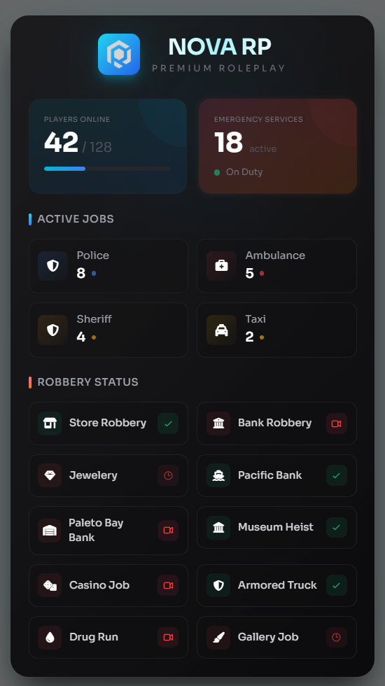

# Code-Crafting for QB-Core (UI Created by [BLDR](https://bldr.chat/))



A QBcore-compatible FiveM resource that provides a responsive scoreboard NUI using React + TypeScript + Vite. The frontend displays player stats, jobs, and robbery status with an optimized NUI lifecycle for smooth open/close behavior.

## Features

- React-based scoreboard UI with Tailwind styling
- Config-driven jobs and illegal robbery actions
- Animated player stats and job counts
- Built for QBcore resource wiring via NUI messages
- Includes `logo.png` preview asset

## Installation

1. Place the `Code-scoreboard` resource folder in your FiveM `resources` directory.
2. Add `ensure Code-scoreboard` to your `server.cfg`.
3. Install frontend dependencies and build the NUI bundle:

```powershell
cd resources\Code-scoreboard\web
npm install
npm run build
```

## Usage

- The resource exposes a QBcore scoreboard NUI that opens and closes in sync with the client logic.
- `fxmanifest.lua` already includes the built web files and `web/dist/logo.png`.
- Frontend data is passed through NUI events from `client/main.lua` and `server/main.lua`.

## Build

From `resources/score/web`:

```powershell
npm run build
```

If you want to run the frontend locally during development:

```powershell
npm run dev
```

## Resource Files

- `config.lua` — job and illegal action definitions
- `client/main.lua` — NUI open/close and event forwarding
- `client/nui.lua` — local NUI configuration
- `server/main.lua` — scoreboard data provider
- `web/src` — React frontend source
- `fxmanifest.lua` — resource metadata and UI page registration

## Notes

- The preview image shown in this README is stored at `preview.png`.
- Make sure the NUI bundle is rebuilt after frontend changes so `web/dist` stays current.
